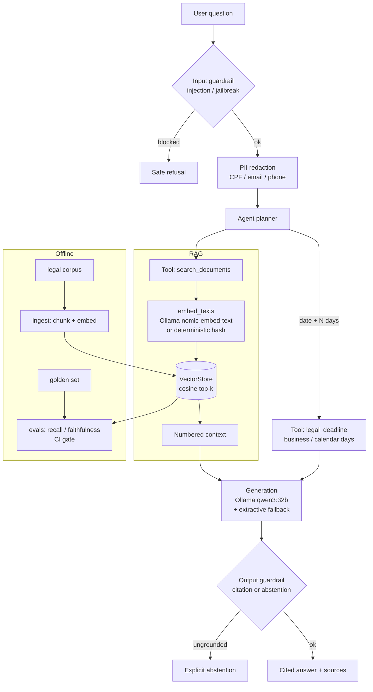

# anchora

> Domain RAG agent for **Brazilian legal-administrative texts** — answers with citations, tool use, *evals* in CI, guardrails, and LoRA *fine-tuning*. **100% local-first** (Ollama), with no paid APIs.

`anchora` ("anchor") is an agent that **anchors** every answer in the source documents: it retrieves passages from the corpus, answers by citing the source `[n]`, and **refuses to make things up** — if the answer is not in the documents, it abstains. It goes beyond a simple RAG by **using tools** (search + legal deadline calculation) and by validating input and output with **deterministic guardrails**.

The domain is Brazilian public law: LAI, Lei 8.112, Defensoria Pública, LGPD, CPC deadlines, Lei 14.133 (procurement), Lei 9.784 (administrative procedure), and free legal aid.

---

## What makes this more than a RAG demo

Most RAG demos work on the happy path. The focus here is the opposite: **measuring
when the system is wrong, and making it abstain instead of bluffing.** The
engineering follows from that stance:

- **RAG + agent with tools** — retrieval plus `legal_deadline` calculation and
  `search_documents`, not just "chat over a PDF";
- **hybrid retrieval, measured** — BM25 + dense fused with Reciprocal Rank
  Fusion, with an [ablation](#retrieval-hybrid-bm25--dense) proving the default
  beats either alone, not just asserting it;
- **production guardrails, attacked on purpose** — anti-injection, PII redaction,
  and a mandatory grounding check, verified by a
  [44-attack adversarial suite](#adversarial-guardrail-suite) that gates CI;
- **honest, reproducible evals in CI** — deterministic lexical proxies gate the
  build with no model, no network, and no cost — and are
  [calibrated](docs/eval-calibration.md) against a real LLM judge so we know
  their blind spots;
- **observable** — every answer carries a `trace_id` and per-stage timings, with
  a [latency benchmark](#latency) that gates against p95 regressions;
- **a fine-tuning study that caught its own leak** — a headline 0.92 that turned
  out to be measured on the training set, and what the real number was ([below](#fine-tuning-how-i-caught-my-own-eval-grading-its-own-homework));
- **MLOps** — process → train → evaluate → register, with a promotion gate that
  auto-rejects regressions, plus SageMaker and Terraform scaffolding;
- **engineering hygiene** — `uv`, `ruff`, `mypy --strict`, `pytest` with coverage,
  Docker, GitHub Actions.

Everything runs **offline and for free**: embeddings and generation via Ollama, plus a deterministic `hash` embedding provider so that **tests and CI are reproducible without a model or network**.

---

## Architecture



Layers (`src/anchora/`):

| Module | Responsibility |
|---|---|
| `chunking` | splits text into overlapping word windows |
| `embeddings` | Ollama `nomic-embed-text` + deterministic `hash` fallback (unit-norm, *accent-folded*) |
| `store` | in-memory `VectorStore`, cosine search, JSON persistence |
| `ingest` | reads the corpus (`title:` front-matter), *chunk* → *embed* → store |
| `rag` | `retrieve(store, query, k)` |
| `llm` | generation with citations via Ollama; `None` when offline |
| `tools` | `search_documents` (RAG) + `legal_deadline` (business/calendar days) |
| `agent` | orchestrates guardrails → planner → tools → answer → validation |
| `guardrails` | anti-injection, PII detection/redaction, output *grounding* |
| `metrics` | deterministic lexical proxies for faithfulness / relevance / precision / recall |
| `evals` | offline harness over the *golden set* + CI *gate* |
| `api` | FastAPI: `/health`, `/ingest`, `/ask` (API-key + PII redaction) |
| `cli` | `ingest` / `ask` / `eval` / `serve` |

---

## Installation

Prerequisites: Python ≥ 3.12 and [`uv`](https://docs.astral.sh/uv/). To use the local models, [Ollama](https://ollama.com) with:

```bash
ollama pull nomic-embed-text
ollama pull qwen3:32b
```

```bash
uv sync --extra dev
```

---

## Usage

### CLI (offline, no model — `hash` provider)

```bash
# Ask (deterministic extractive fallback, no LLM)
uv run anchora ask "What are the bidding modalities?" --provider hash --no-llm

# Deadline calculation (the agent detects a date + N days and calls the tool)
uv run anchora ask "Deadline of 15 business days from 2026-06-24?" --provider hash --no-llm

# Index a corpus and save the index
uv run anchora ingest --corpus data/corpus --out store.json --provider hash

# Run the evaluation gate
uv run anchora eval
```

### With the local models (Ollama)

```bash
# omit --provider/--no-llm to use nomic-embed-text + qwen3:32b
uv run anchora ask "What is the appeal deadline under the LAI?"
```

### API

```bash
uv run anchora serve              # http://127.0.0.1:8000  (/docs for Swagger)
```

```bash
curl -s localhost:8000/health
curl -s -X POST localhost:8000/ingest -H 'content-type: application/json' \
  -d '{"provider":"hash"}'
curl -s -X POST localhost:8000/ask -H 'content-type: application/json' \
  -d '{"question":"What are the bidding modalities?","use_llm":false,"provider":"hash"}'
```

Streaming (Server-Sent Events) — incremental `token` events then a terminal
`done` event carrying sources, grounding and the trace:

```bash
curl -N -s -X POST localhost:8000/ask/stream -H 'content-type: application/json' \
  -d '{"question":"What are the bidding modalities?","use_llm":false,"provider":"hash"}'
```

Set `ANCHORA_API_KEY` (or `api_key` in `.env`) to require the `x-api-key` header.
Every response echoes an `x-request-id` header (minted if the caller omits it).

---

## Evaluation

`anchora` is evaluated against a *golden set* of 24 questions (`data/golden/golden.json`) covering the 8 documents in the corpus. The metrics are **deterministic lexical proxies** of DeepEval/RAGAS — honest and reproducible, suitable for a CI *gate* at no cost:

| Metric | What it measures |
|---|---|
| `context_recall` | did the expected document appear in the top-k? |
| `context_precision` | fraction of retrieved passages that came from the expected doc |
| `faithfulness` | how much of the answer is supported by the retrieved context |
| `answer_relevance` | how much of the question's intent the answer covers |

The *gate* (`uv run anchora eval`) fails the build if **retrieval recall < 1.0** or if **average faithfulness < 0.70** (`faithfulness_threshold`). The **LLM-judge** versions (DeepEval/RAGAS via Ollama) can be run locally — see `scripts/compare_evals.py`.

> Why lexical proxies in CI? An LLM *judge* is non-deterministic and (for hosted judges) costs money. The proxies provide an objective, free floor; the local *judge* remains available for richer analysis. How far the proxy tracks a real judge — and where it is blind (negation, paraphrase, numbers) — is measured in [`scripts/calibrate_judge.py`](scripts/calibrate_judge.py) and documented in [`docs/eval-calibration.md`](docs/eval-calibration.md).

### Retrieval: hybrid (BM25 + dense)

Dense cosine generalizes across phrasing; BM25 nails rare statute vocabulary.
`anchora` fuses both with Reciprocal Rank Fusion (`retrieval_mode=hybrid`, the
default). The choice is backed by an ablation, not a hunch — reproduce it with
`make ablation` ([ADR 4](docs/adr/0004-hybrid-retrieval-rrf.md)):

| Dataset | Mode | Recall@4 | Precision@4 | MRR@4 |
|---|---|---:|---:|---:|
| golden (train, n=24) | dense | 1.000 | 0.438 | 0.972 |
| golden (train, n=24) | bm25 | 1.000 | 0.622 | 1.000 |
| golden (train, n=24) | **hybrid** | 1.000 | 0.438 | 1.000 |
| holdout (unseen) | dense | 0.864 | 0.352 | 0.833 |
| holdout (unseen) | bm25 | 0.909 | 0.542 | 0.886 |
| holdout (unseen) | **hybrid** | 0.909 | 0.386 | 0.909 |

On unseen questions hybrid matches BM25's recall while topping the MRR of both.

### Adversarial guardrail suite

`data/adversarial/attacks.json` holds 44 attacks — prompt injection, jailbreak,
PII exfiltration, citation forgery, off-domain — replayed through the served
pipeline by `scripts/adversarial_suite.py` (`make adversarial`, a CI gate):

| Category | Handled |
|---|---:|
| citation_forgery | 6/6 |
| injection | 11/11 |
| jailbreak | 7/7 |
| off_domain | 11/11 |
| pii_exfiltration | 8/8 |

3 limitations (base64-encoded payload, indirect roleplay, single-token lexical
collision) are reported as **documented known gaps** rather than claimed as
blocked — the same honesty stance as the evals.

### Latency

`make bench` runs the offline pipeline over the golden questions and reports
p50/p95 per stage with a regression gate (`--max-p95-ms`). Every `AgentResult`
and `/ask` response carries a `trace_id` and per-stage `timing_ms`, and the API
echoes an `x-request-id` on every response for correlation.

### Fine-tuning: how I caught my own eval grading its own homework

LoRA fine-tuning is wired with `scripts/finetune_lora.py` and
`scripts/evaluate_finetune.py`, run on Apple Silicon MPS against
`Qwen/Qwen2.5-1.5B-Instruct`. The first run looked like a triumph:
**0.92 grounded rate vs. 0.17 for the base model.**

Then I noticed the training set was built from the same 24-question golden set I
was scoring on — **train == test.** The 0.92 mostly measured memorization of 24
answers, not a skill. What I did about it:

1. **Built a disjoint holdout** — 28 brand-new questions over the same corpus
   (22 answerable, 6 out-of-corpus), asserted disjoint from training in
   `tests/test_holdout.py`. The adapter never saw them.
2. **Added a fair few-shot baseline** — the base model given the same `PT + [n]`
   output contract via few-shot, to separate *learned knowledge* from *learned
   format*.
3. **Fixed the metrics** — `grounded_rate` only checked for a `[n]` bracket, so I
   added `citation_correct` (does the cited index resolve to the *expected*
   document?); the exact-English abstention check missed Portuguese refusals, so I
   added PT-aware detection.

On the holdout, under metrics that measure what they claim, the promotion
candidate (`LoRA + 5 abstention`) still beats the base+few-shot baseline on both
axes — the win is smaller than 0.92, but real:

| Row | Citation-correct ↑ | Abstention (PT-aware) ↑ | Faithfulness ↑ |
|---|---:|---:|---:|
| base + few-shot | 0.500 | 0.167 | 0.197 |
| **LoRA + 5 abstention** | **0.818** | **0.833** | 0.726 |

These numbers are **reproduced by CI without a GPU**. Generation needs Apple
Silicon, but the real decoded outputs are frozen in
`data/eval/holdout-generations.json` and re-scored deterministically through the
same scorer (`retrieval = hash`), so a mismatch fails the build:

```bash
# Reproduce (no GPU, no network): re-score frozen generations + replay the gate
make eval-honest
```

The holdout also exposed a failure the leaked eval never could: the first adapter
**never abstained** — on out-of-corpus questions it fabricated confident answers
with fake citations. Adding 5 abstention examples fixed it (0.00 → 0.83) at a
small, measured cost to answer precision; a sweep showed 5 examples dominate 10 on
every axis. A promotion gate wired to these honest metrics
(`gate_promotion.py` + `registry.regressions`) then **auto-rejected** the
over-cautious 10-example variant, which regressed citation accuracy 0.818 → 0.636.

Full arc — every failed run, the leak, the fix, the ratio sweep, the gate — in
[`docs/finetuning-results.md`](docs/finetuning-results.md).

---

## Roadmap

**Shipped**

| Version | Deliverable |
|---|---|
| **v0.1** | RAG + agent with tools + FastAPI + README/diagram ✅ |
| **v0.2** | *evals* in CI + guardrails ✅ |
| **v0.3** | LoRA *fine-tune* + baseline vs. tuned comparison on a held-out set; **5-abstention adapter promoted** via the gate, 10-abstention variant auto-rejected for regressing citation accuracy ✅ |
| **v0.4** | managed ML pipeline (SageMaker scaffolding) + *model registry* + Terraform ✅ |
| **v0.5** ← current | hybrid retrieval (BM25 + dense, RRF) with measured ablation · adversarial guardrail suite · latency benchmark + request tracing · SSE streaming · ADRs, model card & datasheet ✅ |

**Next — v1.0 (demo + close the documented gaps)**

Every item below is traceable to a limitation this repo already names, so the
roadmap closes known gaps instead of chasing new surface:

- [ ] **Recorded demo** (asciinema/GIF) of the CLI + API flow, linked from the README.
- [ ] **Methodology write-up** — the eval-leak → honest-holdout arc as a short public post.
- [ ] **Semantic out-of-domain floor** — replace the lexical abstain check with an
  embedding-similarity threshold, closing the single-token-collision gap (`ood-008`
  in the adversarial suite).
- [ ] **Real-token SSE** — stream tokens from Ollama as they decode, replacing the
  current post-hoc word chunking (see `POST /ask/stream`).
- [ ] **Judge-calibrated thresholds** — once `scripts/calibrate_judge.py` has a
  judged sample, set the CI faithfulness floor from measured proxy/judge agreement
  rather than a hand-picked 0.70.

**Deliberately out of scope** (stated so the boundaries are a choice, not an omission)

- A hosted-API path — local-first is a design constraint ([ADR 2](docs/adr/0002-local-first-no-paid-apis.md)), not a missing feature.
- A web UI — this is a retrieval/eval/guardrails engine; the API and CLI are the surface.
- A larger corpus — the point is measured behaviour on a fixed, auditable set, not coverage breadth.

---

## Documentation

- **Architecture decisions** — [`docs/adr/`](docs/adr/): deterministic proxies in
  CI, local-first, hand-rolled RAG, hybrid retrieval (RRF), and 5-vs-10 abstention.
- **Model card** — [`docs/model-card.md`](docs/model-card.md): the promoted LoRA
  adapter, its held-out metrics, limitations and governance.
- **Datasheet** — [`data/README.md`](data/README.md): what every dataset is, how
  it was built, and the synthetic-PII note.
- **Eval calibration** — [`docs/eval-calibration.md`](docs/eval-calibration.md):
  proxy-vs-judge agreement and the proxy's blind spots.
- **Fine-tuning arc** — [`docs/finetuning-results.md`](docs/finetuning-results.md):
  the leak, the fix, the ratio sweep, the gate.

## Development

```bash
uv run ruff check .
uv run ruff format --check .
uv run mypy
uv run pytest
```

Or all at once: `make check` — runs lint, format, types, tests, the eval gate,
the honest fine-tune replay, the adversarial suite and the latency benchmark.

## License

MIT — see [LICENSE](LICENSE).
